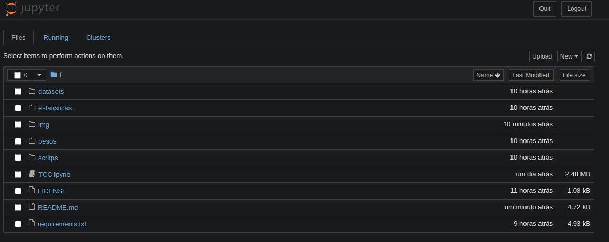
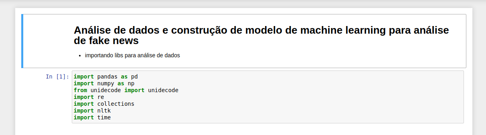
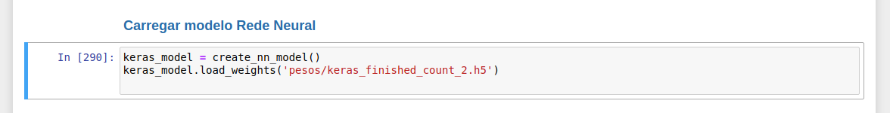

# Proposta de modelo de ML para deteção de fake news

- Trabalho de conclusão da pós graduação de Inteligência Artificial e Aprendizado de Máquina da PUC Minas 

---

## Sumário
- [Estrutura do projeto](#est)
- [Scripts](#scp)
- [Datasets](#data)
- [Pesos](#pesos)
- [Estatísticas](#est)
- [Relatório](#rel)
- [Requerimentos](#req)
- [Executando o projeto](#exec)

---

##  <a name="cont">Contextualização</a>

- Este projeto contempla o processo de construção de alguns modelos de machine learning e deep learning para detecção de fake news contemplando o processo de coleta dos dados, a limpeza e processamento dos dados (Feature Engineering), a visualização e processo de construção das hipóteses e construção e testes em variados modelos.

---
## <a name="est">Estrutura do projeto</a>

##  <a name="scp">Scripts:</a>
- A pasta [scripts](https://github.com/tiuwill/tcc-fake-news-ai-detector/tree/main/scritps) contém os scripts python construídos para a coleta de dados.
    - o arquivo [scrap_agencia_lupa.py](https://github.com/tiuwill/tcc-fake-news-ai-detector/blob/main/scritps/scrap_agencia_lupa.py) é responsável por fazer a coleta das notícias no site da [Agência Lupa](https://piaui.folha.uol.com.br/lupa/)
    - o arquivo [scrap_aosfatos.py](https://github.com/tiuwill/tcc-fake-news-ai-detector/blob/main/scritps/scrap_aosfatos.py) é responsável por fazer a coleta das notícias no site [Aos Fatos](https://www.aosfatos.org/)
    - o arquivo [scrap_github_fakebr_corpus](https://github.com/tiuwill/tcc-fake-news-ai-detector/blob/main/scritps/scrap_github_fakebr_corpus.py) é responsável por fazer a coleta das notícias no repositório do git hub do [FakeBr-Corpus](https://github.com/roneysco/Fake.br-Corpus)
    - o arquivo [etl.py](https://github.com/tiuwill/tcc-fake-news-ai-detector/blob/main/scritps/etl.py) é responsável por juntar as coletas dos outros arquivos e formatar o dataset final.

## <a name="data">Datasets:</a>

- A pasta [datasets](https://github.com/tiuwill/tcc-fake-news-ai-detector/tree/main/datasets) contém todos os resultados de coletas dos scritps, além do merge das coletas representando o dataset final
    - [agencia_lupa.csv](https://github.com/tiuwill/tcc-fake-news-ai-detector/blob/main/datasets/agencia_lupa.csv) arquivo resultante da coleta através do script [scrap_agencia_lupa.py](https://github.com/tiuwill/tcc-fake-news-ai-detector/blob/main/scritps/scrap_agencia_lupa.py) 
    - [aosfatos.csv](https://github.com/tiuwill/tcc-fake-news-ai-detector/blob/main/datasets/aosfatos.csv) arquivo resultante da coleta através do script  [scrap_aosfatos.py](https://github.com/tiuwill/tcc-fake-news-ai-detector/blob/main/scritps/scrap_aosfatos.py)
    - [fakebr-corpus.csv](https://github.com/tiuwill/tcc-fake-news-ai-detector/blob/main/datasets/fakebr-corpus.csv) é resultante do processamento do script [scrap_github_fakebr_corpus](https://github.com/tiuwill/tcc-fake-news-ai-detector/blob/main/scritps/scrap_github_fakebr_corpus.py)
    - [todos_os_dados.csv](https://github.com/tiuwill/tcc-fake-news-ai-detector/blob/main/datasets/todos_os_dados.csv) é resultante do processamento do script [etl.py](https://github.com/tiuwill/tcc-fake-news-ai-detector/blob/main/scritps/etl.py)

    [Descritivo dos datasets](https://github.com/tiuwill/tcc-fake-news-ai-detector/blob/main/Dataset_Description.md)


## <a name="pesos">Pesos:</a>
- A pasta [pesos](https://github.com/tiuwill/tcc-fake-news-ai-detector/tree/main/pesos) contém os pesos dos modelos já treinados. Os mesmos podém ser entendidos através da visualização do relatório.

## <a name="est">Estatísticas</a>
- A pasta [estatisticas](https://github.com/tiuwill/tcc-fake-news-ai-detector/tree/main/estatisticas) contem os resultados das avaliações dos modelos. Os mesmos podem ser entendidos através da visualização do relatório.

## <a name="rel">Relatório:</a>
- [TCC.ipynb](https://github.com/tiuwill/tcc-fake-news-ai-detector/blob/main/TCC%20Final.ipynb) é o notebook com toda a parte de engenharia de dados, visualizações e construção do modelo.
----
## <a name="req">Requerimentos</a>

- Os requerimentos e bibliotecas necessárias para execução deste projeto podem ser encontrados através do arquivo [requirements.txt](https://github.com/tiuwill/tcc-fake-news-ai-detector/blob/main/requirements.txt)

### Em ambiente novo:
- Você pode criar um ambiente (environment) já com os requerimentos utilizando o [anacoda](https://www.anaconda.com/):
```
conda create --name fakedetector --file requirements.txt
```

- Caso tenha criado o ambiente, ative o mesmo com o [anacoda](https://www.anaconda.com/)

```
conda activate fakedetector
```

### Em ambiente existente:

- Você pode instalar em um ambiente (environment) já existente com o anaconda desta maneira:
```
conda install --name fakedetector --file requirements.txt
```

---- 

## <a name="exec">Executando o projeto</a>

- Primeiramente instale os [requerimentos](#req)


### (Opicional) Execite o processo de ETL

- o processo de ETL é opcional visto que já foi executado e os arquivos se encontram na pasta [datasets](https://github.com/tiuwill/tcc-fake-news-ai-detector/tree/main/datasets). Porém caso queira ver o funcionamento, basta executar o arquivo [etl.py](https://github.com/tiuwill/tcc-fake-news-ai-detector/blob/main/scritps/etl.py) que pode ser ecnontrado na pasta de [scripts](https://github.com/tiuwill/tcc-fake-news-ai-detector/tree/main/scritps)

```python
python etl.py
```

- Inicie o jupyter notebook na pasta do projeto onde está o arquivo `TCC.ipynb`

```
jupyter notebook
```

- O navegador será aberto, clique no arquivo `TCC.ipynb`



### Observação

- O notebook pode ser executado do início ao fim executando todas as células, ou célula a célula com o comando `Shift+Enter` ou simplesmente clicar no botão `Run`




- As células de treinamento de modelo, podem demorar um pouco, caso queira apenas testar e validar os modelos, basta carregar os pesos do modelo.

- Todos os modelos foram exportados e possuem uma célula para carregar o modelo treinado, possibilitando pular a parte de treinamento.


